#Analisador Lotofacil
======================
##Autor: *Fábio Moura de Oliveira*

Aumente suas chances de acertar no jogo da lotofacil

Este programa realiza as seguintes análises estatísticas:
* par x ímpar
* primo x não-primos
* externo x interno
* novos x repetidos
* bolas por posição do sorteio;
* bolas na mesma coluna;
* bolas em colunas sequencias e adjacentes;
* algarismo do número da bola na casa das dezenas
* diferenca entre bolas na mesma combinacao
* frequencia: ainda não saiu, deixou de sair, novo e repetindo
* grupo de 1 até 15 bolas, começando a partir de uma coluna específica.
* comparação de bolas coluna por coluna de uma combinação com outra combinação.

Gere filtros baseados nas estatísticas escolhidas.

Atualize a tabela de resultados com um único clique.

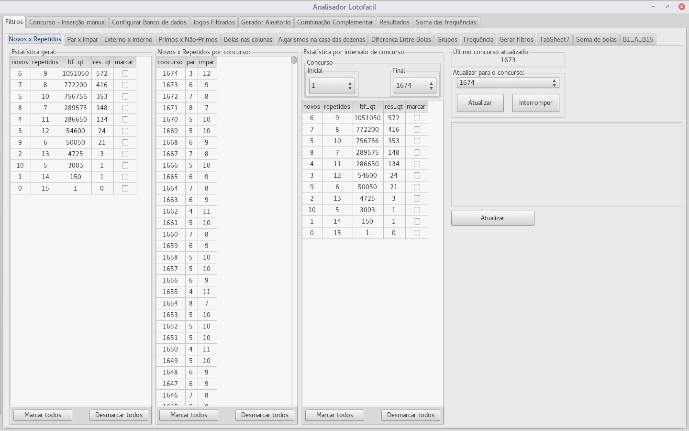

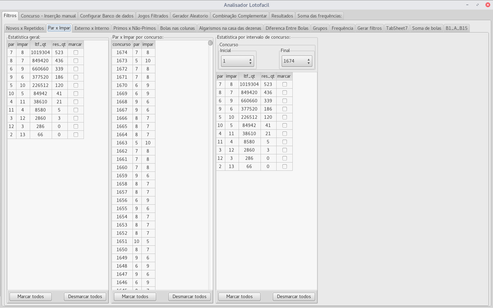

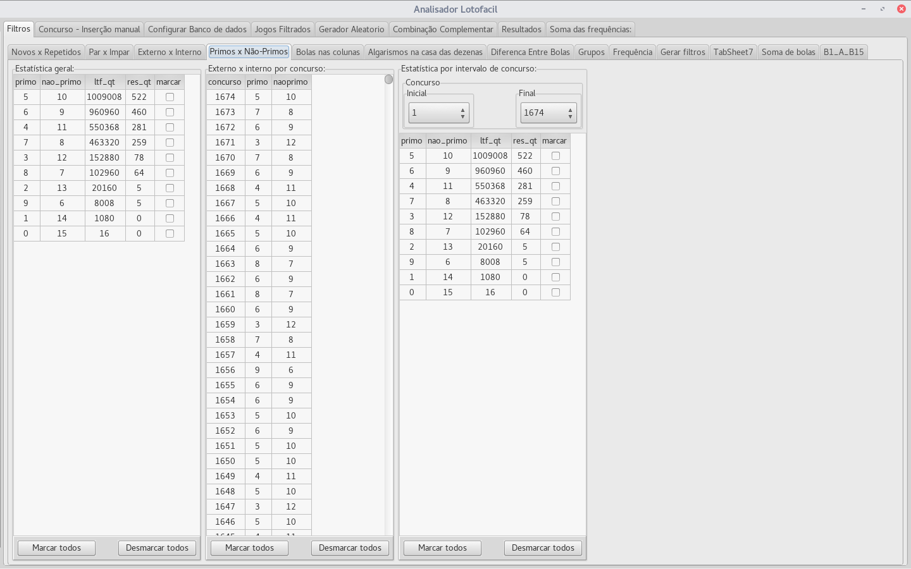

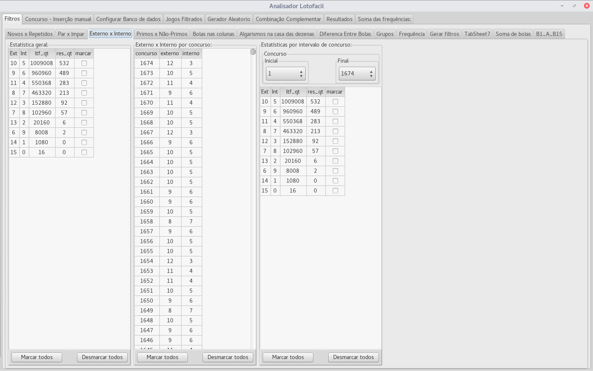

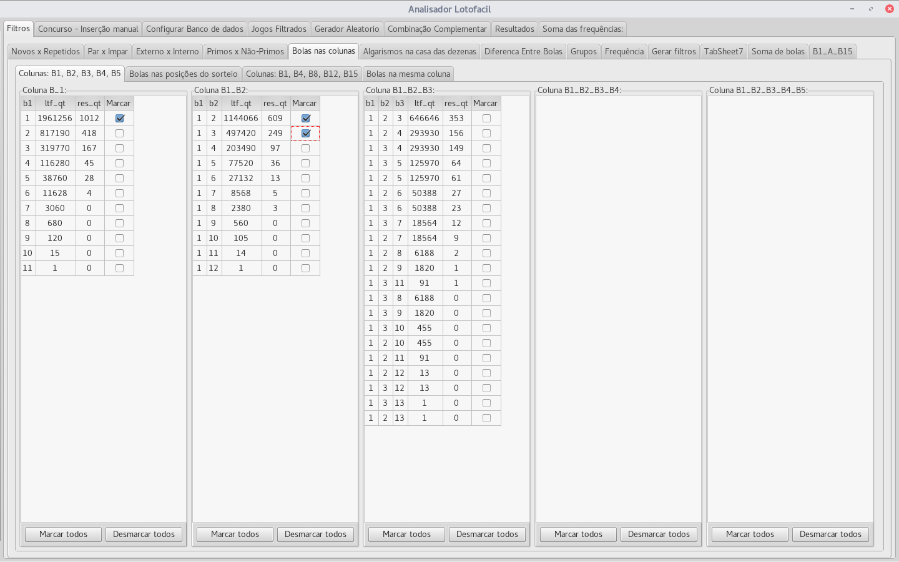

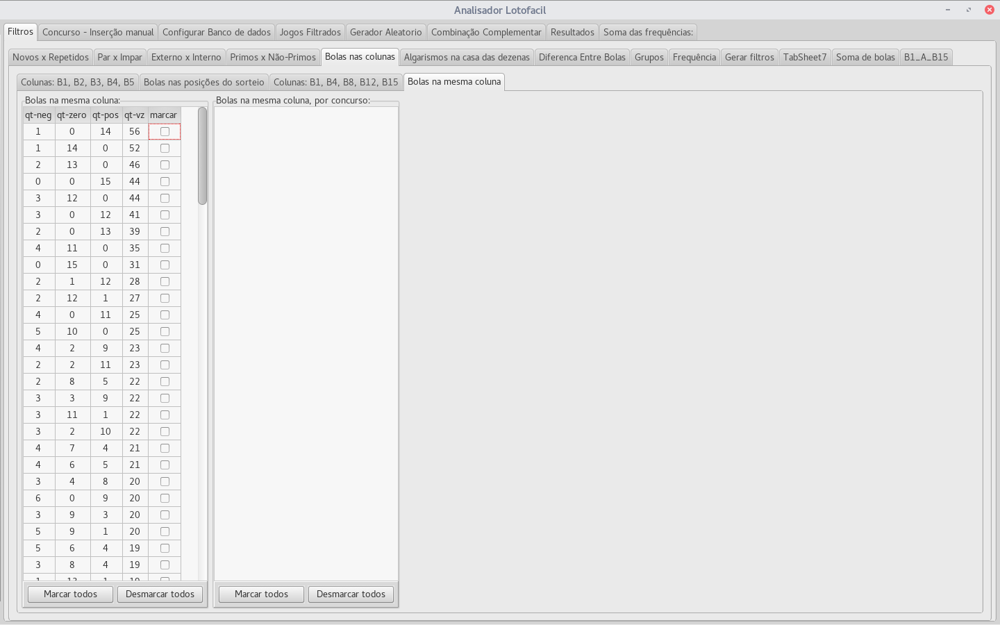

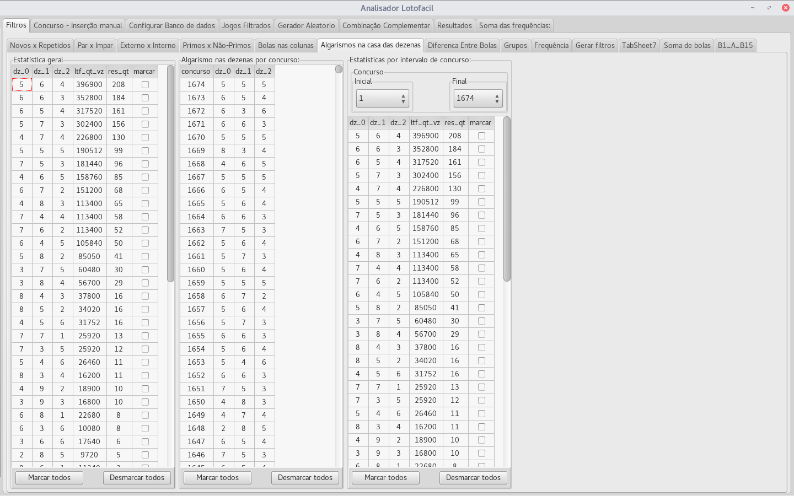

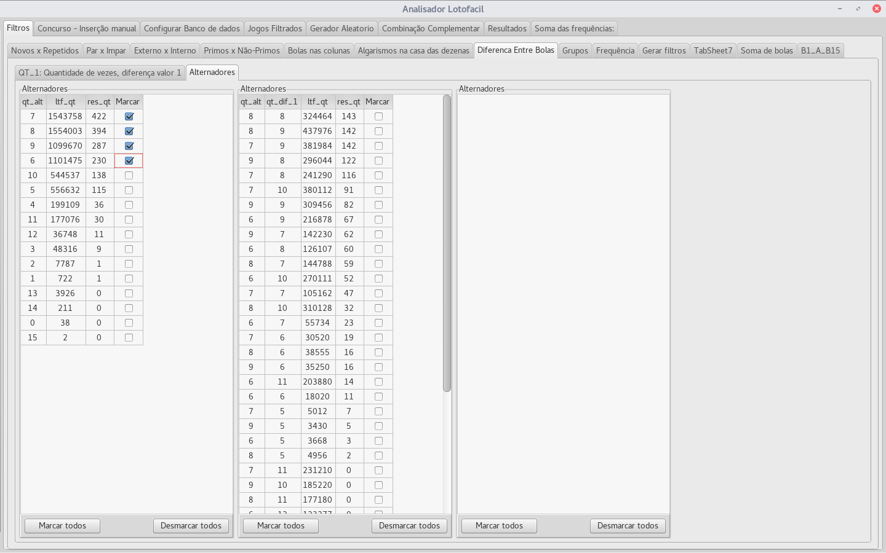

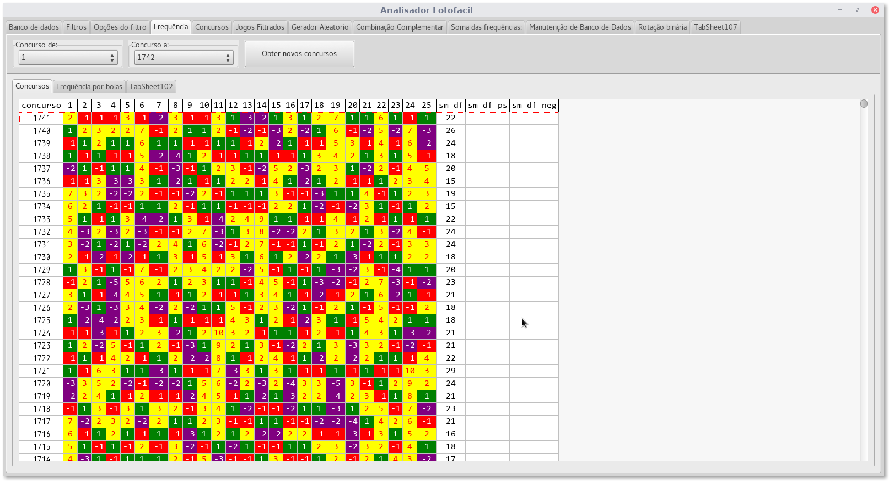

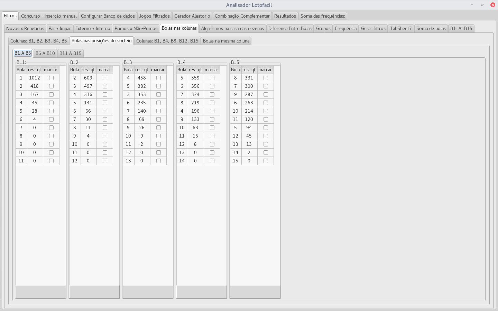

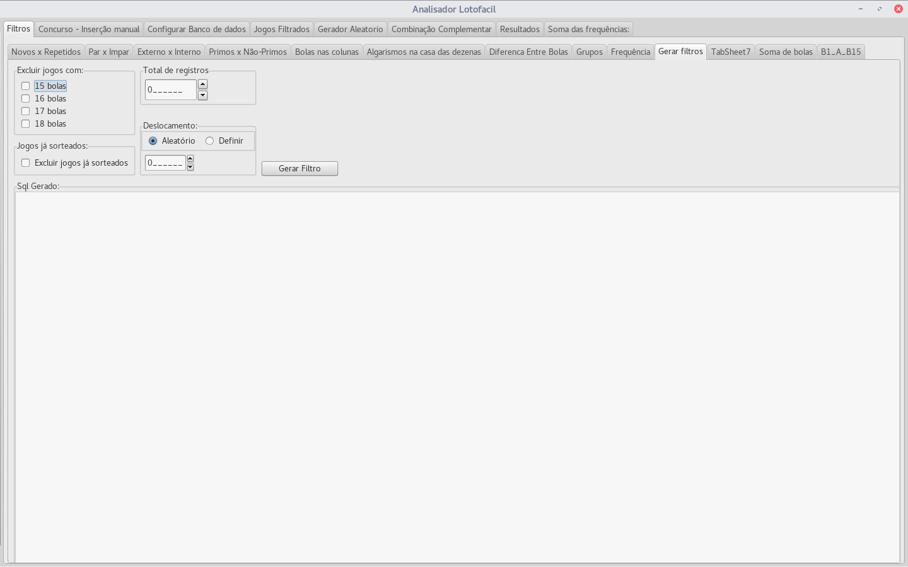

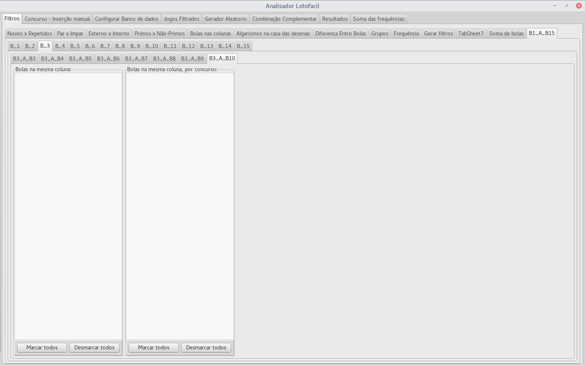

